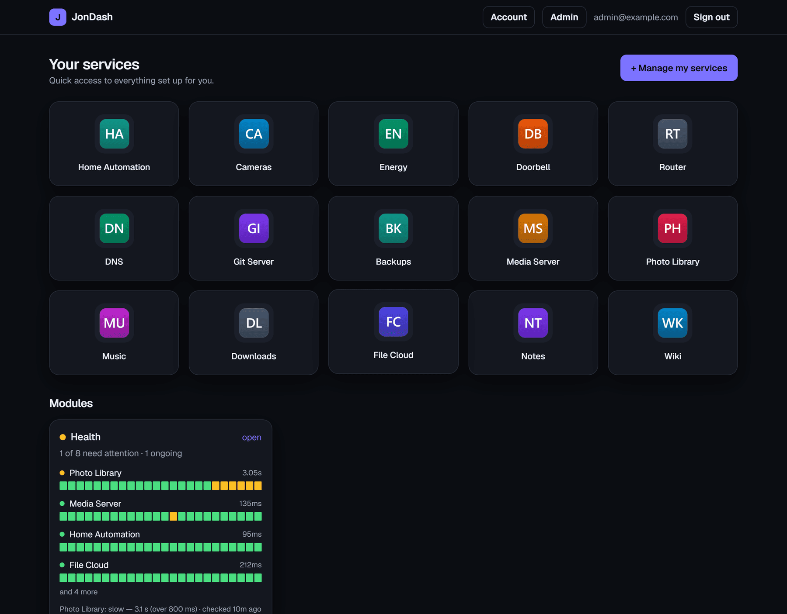
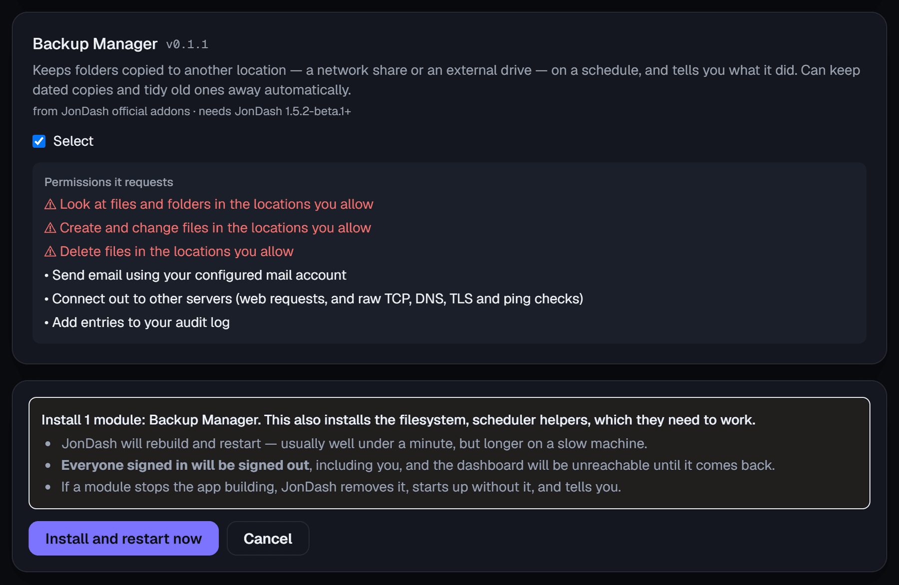
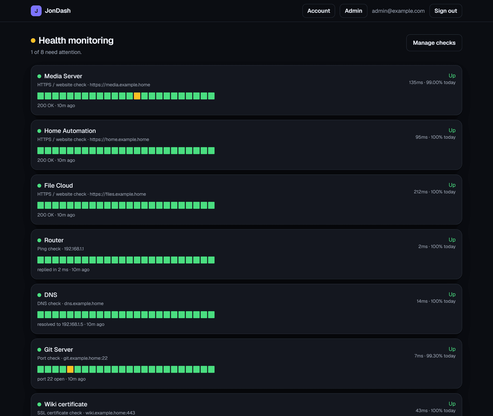
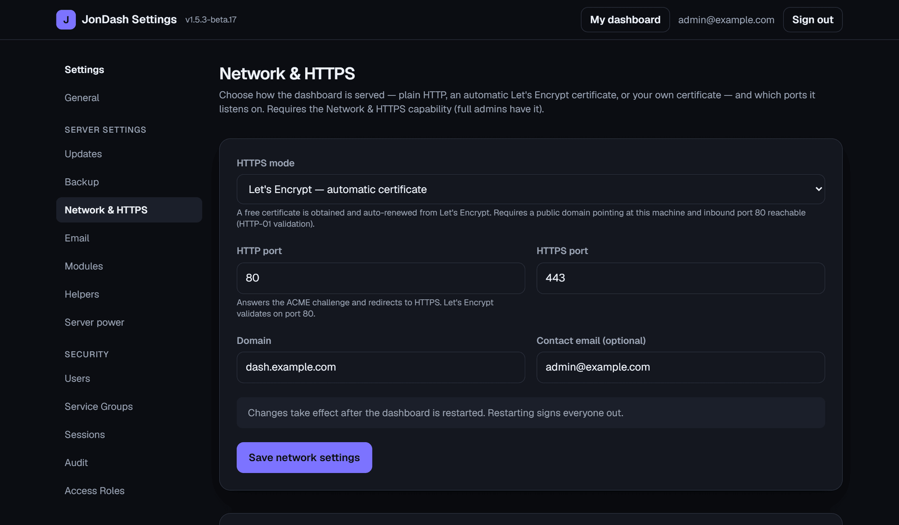

# JonDash

**[Screenshots](docs/SCREENSHOTS.md) · [Features](#features) · [Quick start](#quick-start-windows) · [Modules](#modules) · [Server install](#running-on-a-server) · [Security](#security) · [Changelog](CHANGELOG.md) · [Roadmap](docs/ROADMAP.md)**

A self-hosted, login-protected dashboard for the services you run. Each person signs in and
sees a personal grid of tiles — icon, name, link. You decide what each person sees, and
everything is managed in the web interface: **no coding or file editing, ever.**

Sign-in is **password + authenticator code**. Updates are **one click, in the app**. Optional
**modules** add features without touching the base app.

<table>
<tr>
<td width="50%"><a href="docs/SCREENSHOTS.md"></a></td>
<td width="50%"><a href="docs/SCREENSHOTS.md"></a></td>
</tr>
<tr>
<td width="50%"><a href="docs/SCREENSHOTS.md"></a></td>
<td width="50%"><a href="docs/SCREENSHOTS.md"></a></td>
</tr>
</table>

📷 **[See the full tour →](docs/SCREENSHOTS.md)** — 16 screenshots of every part of the interface.

## Features

- **Per-user dashboards** — each person sees only the tiles you give them.
- **Service Groups** — bundle tiles once, assign them to many people at once.
- **Two-factor sign-in** (authenticator app) with **backup recovery codes**.
- **Delegated admin** — hand out specific admin powers with **Access Roles**, not the lot.
- **Self-service** — users change their own password, re-enrol their authenticator, and
  manage their own sessions.
- **Session manager** and a filterable **audit log** covering sign-ins, admin actions, and
  background work.
- **Full backup & selective restore** — the whole instance in one file. An encrypted backup
  carries credentials and keys too, so two-factor still works after a restore or a move.
- **One-click updates** on a **Stable** or **Beta** channel, with a self-supervising launcher
  that captures crashes, restarts, and **rolls back a failed update**.
- **Optional HTTPS** — automatic Let's Encrypt or bring-your-own certificate, no reverse
  proxy needed (off by default).
- **Outgoing email** — SMTP with an app password or OAuth2, set up in the app.
- **Modules** — add features without touching the base app, with app-store-style permission
  consent. See [Modules](#modules).
- **Zero-config** — database, encryption keys and site address are all set up on first run.

**Stack:** Next.js 16 · React 19 · TypeScript · Tailwind CSS v4 · Prisma + SQLite.

## Quick start (Windows)

1. Install **Node.js** if you don't have it (one-time) — the "LTS" build from <https://nodejs.org>.
2. **Double-click `start-dashboard.bat`.**
3. Your browser opens at **http://localhost:3000**, and the first run walks you through
   creating the administrator account: email, password, and scanning a QR code into an
   authenticator app (Google Authenticator, Authy and similar all work).

Leave the console window open while you use it; close it to stop. There is nothing to
configure by hand.

**Then:** create a user under Settings → Users and send them the one-time setup link. They
choose a password, scan the QR code, save their recovery codes, and they're in.

## Modules

**Modules** are optional add-ons that plug extra features into JonDash — a dashboard widget,
their own pages, their own settings — **without changing the base app**. Remove one and
JonDash behaves exactly as before, like removing an app from a phone.

Before anything is installed you approve what it can do, in plain language: connecting out to
other servers, using your encryption key, writing audit entries, sending email. An
**install-time verifier** refuses code that reaches for a capability it didn't declare,
touches the filesystem, builds code at runtime, reads the server's environment, or reaches
into JonDash's internals. That's a strong safety net, **not a sandbox** — a module still runs
with the app's privileges, so only install modules you trust.

Three ways to add one:

- **From a source** — the official [JonDash-addons](https://github.com/jontiadcock/JonDash-addons)
  source is set up for you, and you can add **any public GitHub repo** that publishes modules.
- **Import your own** — build a module and **import its ZIP directly**, no repository involved.
- **Generate one with AI** — paste the self-contained prompt from
  [docs/MODULES-AUTHORING.md](docs/MODULES-AUTHORING.md) into any AI agent, describe what you
  want, and import the result.

Modules update **independently of JonDash**, on their own stable/beta channel, from
**Admin → Updates** — the one page for everything that updates. Nothing updates itself unless
you turn **Automatic updates** on; it is **off by default**, and each of JonDash, every module
and every helper then gets its own switch to exclude it. An update is **never** applied
automatically when it asks for more access than you approved, would go backwards a version, or
would stop another module working — those wait for you, and the run records what it held back.

**Helpers** are shared components that give modules a capability they can't have alone (for
example, background work that starts with the server). They come **only from the official
source**, arrive automatically with the module that needs them, and are listed read-only under
Admin → Helpers. There is nothing to install or remove.

📖 **Building your own:** [docs/MODULES-AUTHORING.md](docs/MODULES-AUTHORING.md) — the full
contract, permission list, testing process, and the AI prompt. Helper design:
[docs/HELPERS-DESIGN.md](docs/HELPERS-DESIGN.md).

## Running on a server

JonDash is a standard Next.js server and runs on a Linux VPS:

```bash
npm ci
npm run db:migrate      # apply the database schema
npm run build
npm run start           # serves on port 3000
```

- Run it under a process manager (systemd/pm2). **For HTTPS**, either enable JonDash's
  **built-in TLS** (Admin → Network & HTTPS — Let's Encrypt or bring-your-own, no reverse
  proxy needed) **or** put **nginx / Caddy in front** proxying to `127.0.0.1:3000`. Either
  way, served over HTTPS the app switches cookies to Secure and enables HSTS automatically.
- Behind a proxy, forward `X-Forwarded-Host` / `X-Forwarded-Proto` / `X-Forwarded-For`
  (nginx and Caddy set these by default).
- **Back up** `prisma/` (database), `uploads/` (icons) and `.data/` (auto-generated encryption
  key). Losing `.data/` makes stored two-factor secrets unrecoverable. The in-app encrypted
  backup covers all three.

## Security

Passwords are hashed with **argon2id** under an enforced strength policy; **TOTP two-factor**
is required and its secrets are **encrypted at rest** (AES-256-GCM). Sessions are opaque random
tokens **stored hashed**, in httpOnly SameSite=Strict cookies, expiring server-side and
revocable at any time, with **rate limiting and lockout** on password and two-factor attempts.
Authorization is enforced **server-side on every** protected page, action and route.

The browser side is locked down with a **nonce-based CSP**, `frame-ancestors 'none'`, `nosniff`,
`Referrer-Policy`, `Permissions-Policy` and HSTS on HTTPS; CSRF is covered by SameSite=Strict
cookies plus a same-origin assertion on every change. Uploaded icons are type-checked,
size-capped, **re-encoded to PNG** (which strips embedded payloads), stored outside the web
root and served through an authenticated, ownership-checked route.

Full detail and the test report: [docs/SECURITY-REVIEW.md](docs/SECURITY-REVIEW.md). Please
report a security problem privately via [github.com/jontiadcock](https://github.com/jontiadcock)
rather than opening a public issue.

## The JonDash project

| Repository | What it is |
| ---------- | ---------- |
| **[JonDash](https://github.com/jontiadcock/JonDash)** *(you are here)* | The dashboard itself — the app you install and run. |
| **[JonDash-addons](https://github.com/jontiadcock/JonDash-addons)** | The official source of add-on **modules** and **helpers**, installed from inside JonDash. |
| **[JonDash-mcp](https://github.com/jontiadcock/JonDash-mcp)** | An [MCP](https://modelcontextprotocol.io) server so an AI assistant can read and manage your instance. |

## Documentation

| Document | What's in it |
| -------- | ------------ |
| [docs/SCREENSHOTS.md](docs/SCREENSHOTS.md) | A tour of every part of the interface |
| [CHANGELOG.md](CHANGELOG.md) | What changed in every release, both channels |
| [docs/ROADMAP.md](docs/ROADMAP.md) | Build queue and feature catalog — what's planned and what shipped |
| [docs/MODULES-AUTHORING.md](docs/MODULES-AUTHORING.md) | Module contract, permissions, testing, AI prompt |
| [docs/HELPERS-DESIGN.md](docs/HELPERS-DESIGN.md) | What helpers are and the rules they follow |
| [docs/SECURITY-REVIEW.md](docs/SECURITY-REVIEW.md) | Security review and test report |
| [CONTRIBUTING.md](CONTRIBUTING.md) | Project layout, developer commands, running the tests, CI |

## License

**Personal-use** — see [LICENSE](LICENSE). Free for your own **personal, non-commercial** use;
no selling, no redistribution. You may build your own add-on modules — if you share one,
publish it in your own public repository and let the author know via GitHub so it can be
linked.
