# A look around JonDash

Every screenshot below is a real instance with invented data — made-up people, made-up
services, made-up hostnames. **Click any image to open it full size.**

The demo has the optional [Health monitoring](https://github.com/jontiadcock/JonDash-addons)
module installed, which is why some pages mention it; a stock install has no modules at all.

---

## The dashboard

Each person signs in and gets their own grid of service tiles — icon, name, link. Nothing
else is on the page, because that is the whole job. Tiles come from **Service Groups** you
assign, plus any personal tiles you add for that one person.

## What a module adds

A module can put a **widget on the dashboard** and pages of its own, without changing the
base app. Here the Health monitoring module reports on everything it watches, and stays
quiet unless something needs attention.

<table>
<tr>
<td width="34%" valign="top">
<a href="images/health-widget.png">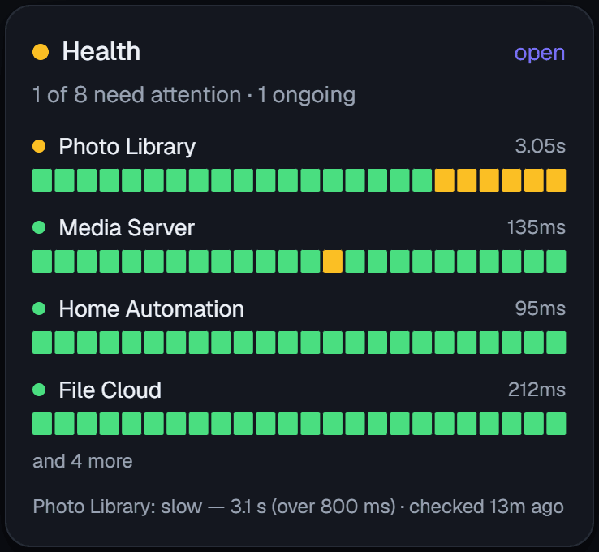</a>
</td>
<td width="66%" valign="top">

</td>
</tr>
</table>

One check in detail — uptime over a day, a week and a month, response time, and every
outage it has recorded.

<a href="images/health-detail.png">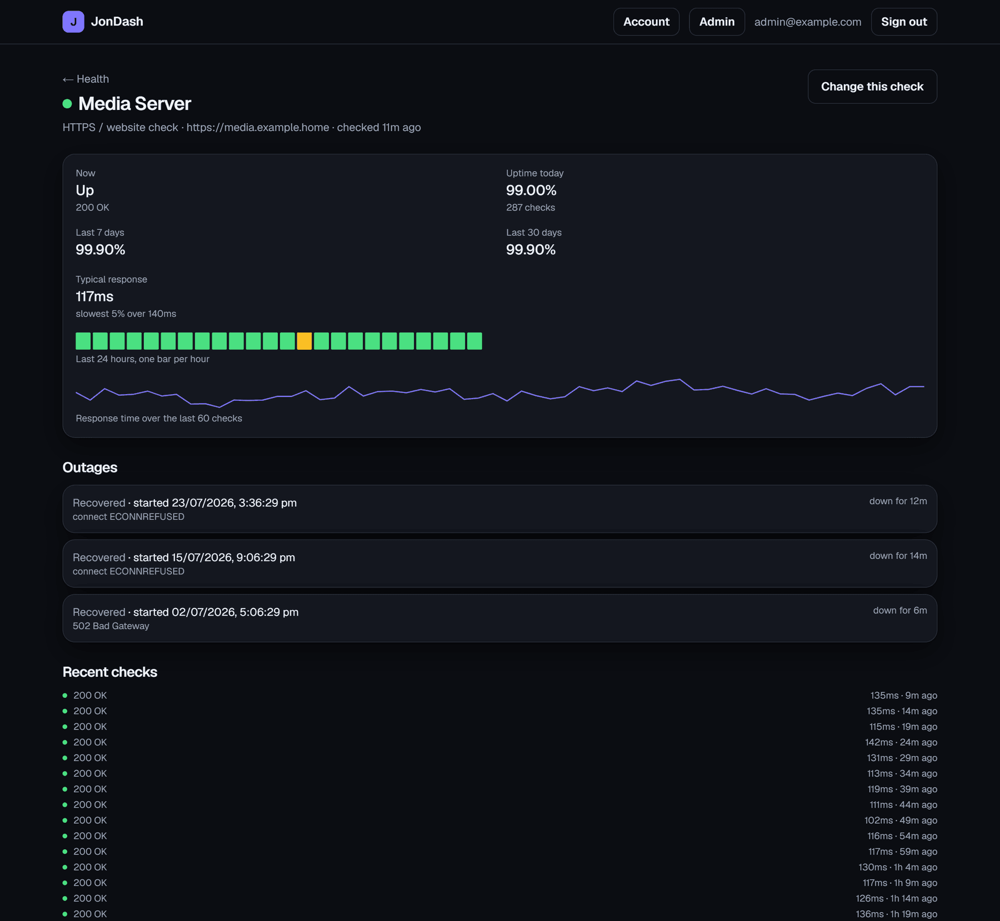</a>

## Installing a module

Browse what a source publishes, tick what you want, and install several in one go. Every
module states what it can do **before** it is installed, in plain language — and anything
riskier than the ordinary is called out in red.

<table>
<tr>
<td width="50%" valign="top">
<a href="images/modules-browse.png">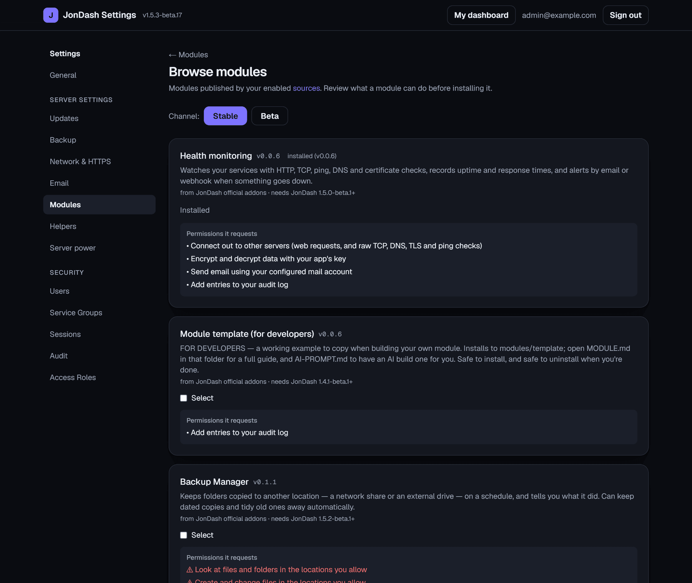</a>
</td>
<td width="50%" valign="top">

</td>
</tr>
</table>

## Updates

**One page for everything that updates** — JonDash itself, every module, and the helpers
modules rely on. Nothing updates itself until you turn automatic updates on, and each item
can be excluded or put on the beta channel individually.

<a href="images/updates.png">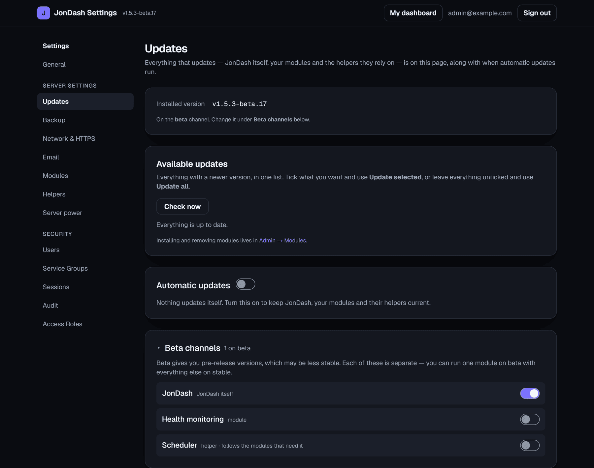</a>

## Automatic HTTPS

Turn on **Let's Encrypt** and JonDash obtains a free certificate, renews it before it expires,
and redirects HTTP to HTTPS — no reverse proxy and no manual certificate wrangling. A
bring-your-own certificate works too, and either way it's off until you ask for it.

## Signing in

Password, then a code from an authenticator app. Recovery codes cover a lost phone.

<table>
<tr>
<td width="50%" valign="top">
<a href="images/login-2fa.png">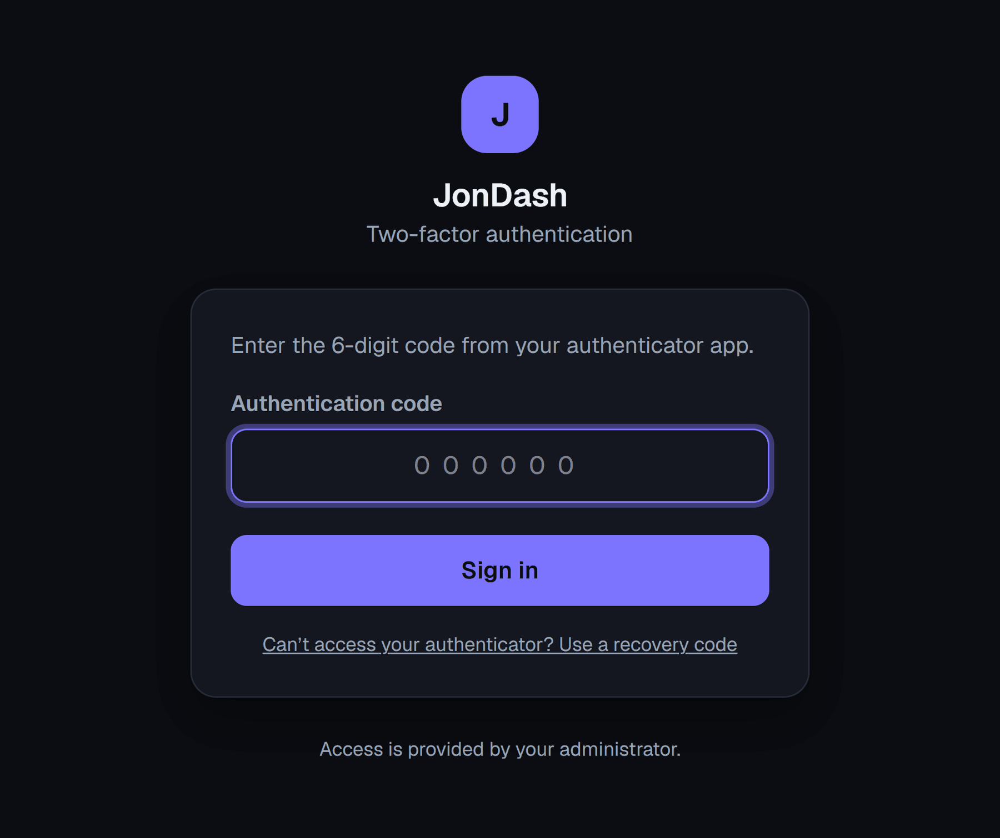</a>
</td>
<td width="50%" valign="top">
<a href="images/account.png">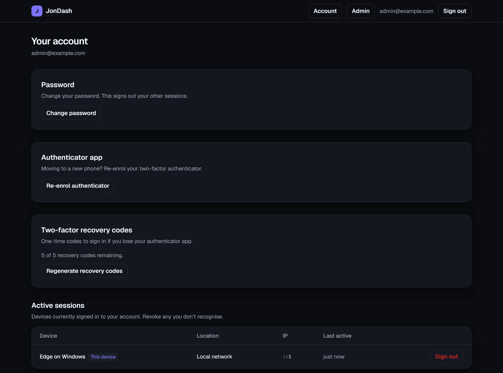</a>
</td>
</tr>
</table>

## Running it

<table>
<tr>
<td width="50%" valign="top">
<a href="images/users.png">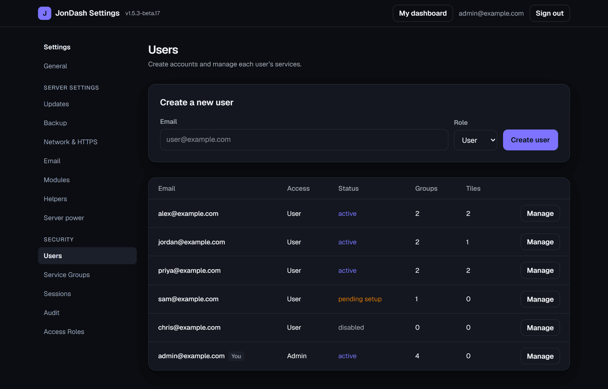</a>

<b>Users</b> — create an account and hand over a one-time setup link.

</td>
<td width="50%" valign="top">
<a href="images/service-groups.png">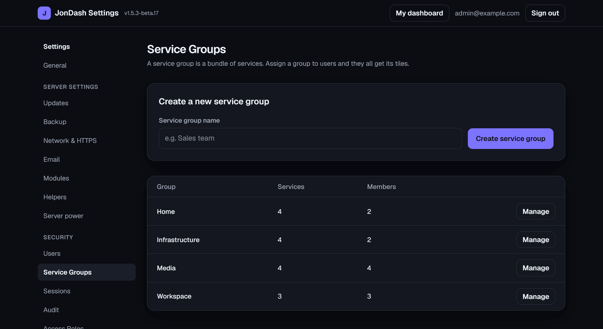</a>

<b>Service Groups</b> — bundle tiles once, assign to many people.

</td>
</tr>
<tr>
<td width="50%" valign="top">
<a href="images/access-roles.png">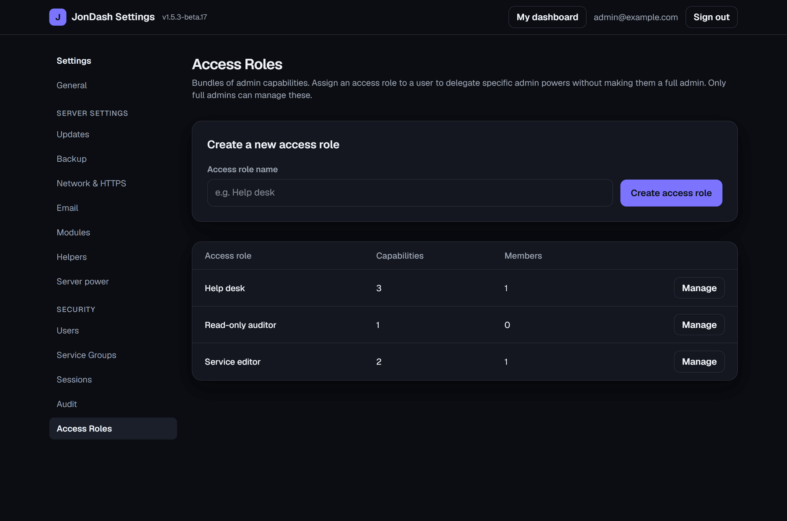</a>

<b>Access Roles</b> — delegate specific admin powers, not the lot.

</td>
<td width="50%" valign="top">
<a href="images/sessions.png">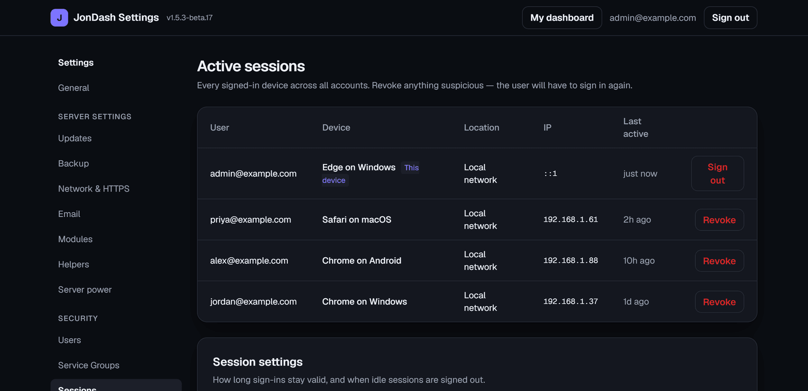</a>

<b>Sessions</b> — see every signed-in device, revoke any of them.

</td>
</tr>
<tr>
<td width="50%" valign="top">
<a href="images/audit.png">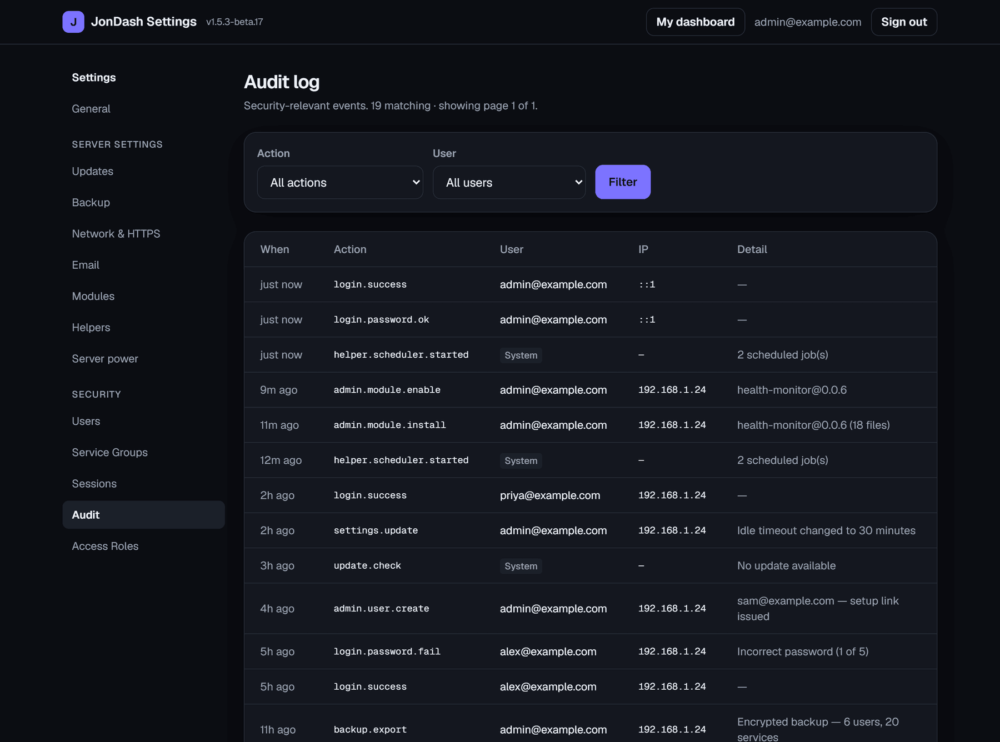</a>

<b>Audit log</b> — who did what, and what ran on its own.

</td>
<td width="50%" valign="top">
<a href="images/backup.png">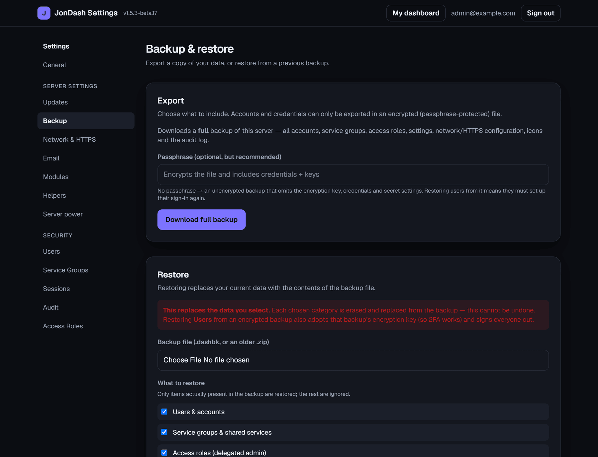</a>

<b>Backup &amp; restore</b> — one file for the whole instance; pick what comes back.

</td>
</tr>
</table>

---

[← Back to the README](../README.md)
